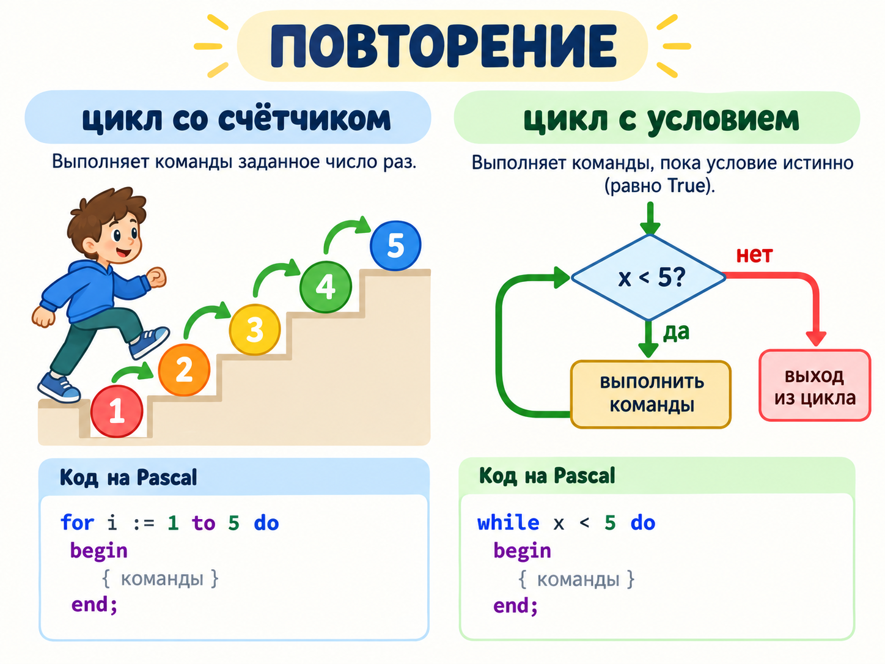

# Урок 4. Циклы `for` и `while`

Цикл повторяет команды. Выбирай `for`, когда количество повторений известно, и `while`, когда повторение зависит от условия.



## Цикл `for`

```pascal
var
  i: integer;
begin
  for i := 1 to 5 do
    writeln(i);
end.
```

Счётчик `i` последовательно принимает значения от 1 до 5 включительно. Для обратного отсчёта используй `downto`:

```pascal
for i := 5 downto 1 do
  writeln(i);
```

## Цикл `while`

```pascal
var
  number: integer;
begin
  number := 1;
  while number <= 5 do
  begin
    writeln(number);
    number := number + 1;
  end;
end.
```

Перед каждой итерацией проверяется условие. Внутри цикла важно менять переменные условия, иначе цикл может не завершиться.

## Практика

1. Выведи числа от 1 до 20.
2. Выведи таблицу умножения на число, введённое пользователем.
3. Найди сумму чисел от 1 до `n`.
4. Считывай числа, пока пользователь не введёт 0, затем выведи их сумму.

## Проверь себя

1. Когда удобнее применять `for`?
2. Что нужно проверить в программе с `while`, чтобы она завершалась?
