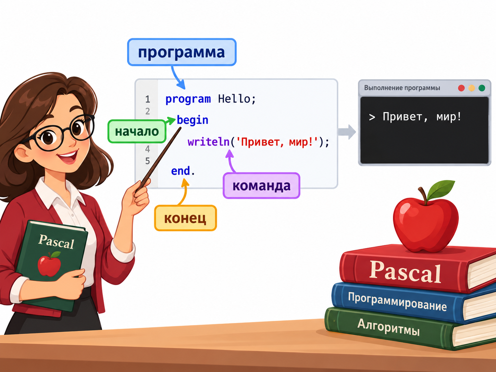

# Pascal: курс для начинающих

Материалы рассчитаны на первые шаги в Pascal и примеры совместимы с Free Pascal. Читай уроки по порядку, набирай программы самостоятельно и проверяй результат в компиляторе.

## Уроки

1. [Первая программа, вывод и ввод](01_basics/01_first_program.md)
2. [Переменные, типы и арифметика](01_basics/02_variables_and_types.md)
3. [Условия и логические выражения](02_conditions/03_conditions.md)
4. [Циклы `for` и `while`](03_loops/04_loops.md)
5. [Массивы и перебор элементов](04_arrays/05_arrays.md)
6. [Процедуры и функции](05_subprograms/06_procedures_and_functions.md)

## Порядок работы

В каждом уроке есть объяснение, примеры, задания и вопросы для самопроверки. Сначала попробуй решить задания самостоятельно, а затем сверяйся с примерами. В примерах используется стандартная структура программы Free Pascal: `program`, раздел объявлений, `begin` и `end.`.

