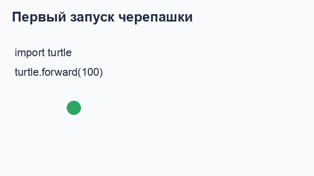
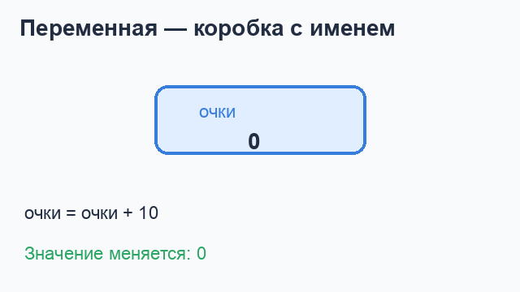
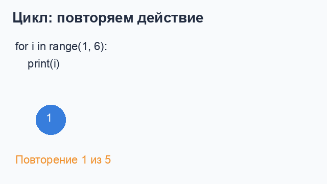
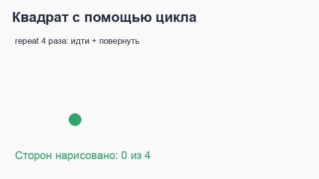
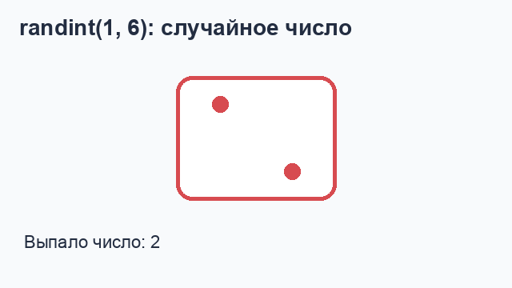
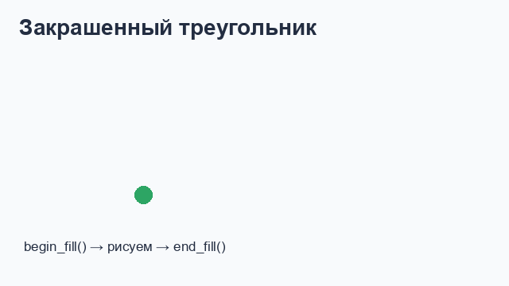
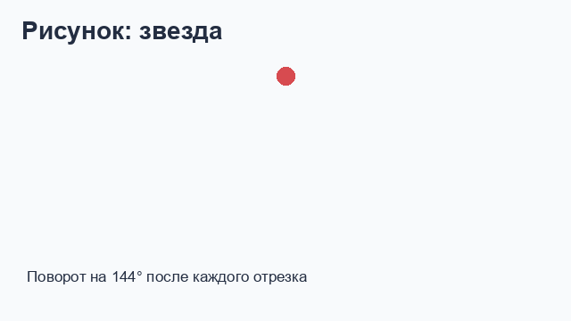
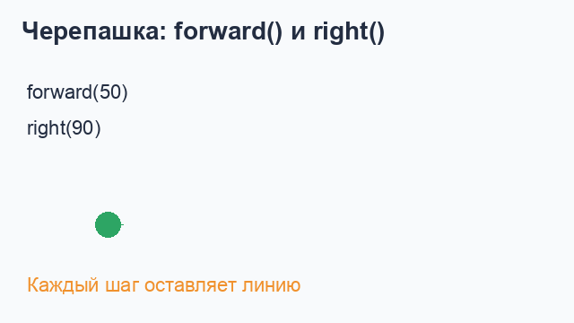

# Python и черепашка: первые шаги

Учебный конспект для ученика 5 класса.

## 1. Как запускать черепашку

В Python есть модуль `turtle` — «черепашка». Она умеет ходить по экрану и оставлять след. Перед началом работы подключим модуль:

```python
import turtle

turtle.forward(100)
turtle.done()
```

`import turtle` подключает черепашку, а `turtle.done()` оставляет окно открытым.



## 2. Переменные

Переменная — это коробка с именем, в которой хранится значение. Значение можно использовать и менять.

```python
name = "Маша"
age = 11
print(name)
print(age)

age = age + 1
print(age)       # теперь 12
```

Знак `=` означает «положить значение в переменную». В строках можно хранить текст, а в числовых переменных — числа. Текст берём в кавычки.



## 3. Циклы

Цикл нужен, когда одно действие надо повторить несколько раз. Это короче и удобнее, чем писать одну и ту же команду много раз.

### Цикл `for` и `range`

```python
for i in range(1, 6):
    print(i)
```

На экране появятся числа от 1 до 5. Обрати внимание на отступ перед `print`: он показывает, какие команды находятся внутри цикла.



### Цикл в черепашке

```python
import turtle

for i in range(4):
    turtle.forward(100)
    turtle.right(90)

turtle.done()
```

Черепашка четыре раза идёт вперёд и поворачивает направо. Получается квадрат.



## 4. Случайное число: `randint`

Функция `randint` из модуля `random` выбирает случайное целое число. Границы включаются.

```python
from random import randint

number = randint(1, 6)
print(number)
```

Этот код похож на бросок кубика: каждый запуск может дать число от 1 до 6.



Пример игры с угадыванием:

```python
from random import randint

secret = randint(1, 10)
guess = int(input("Угадай число от 1 до 10: "))
print("Секретное число было:", secret)
```

`input` получает ответ игрока как текст, а `int` превращает его в целое число.

## 5. Основные команды черепашки

Все команды ниже можно писать после `import turtle`.

| Команда | Что делает | Пример |
|---|---|---|
| `forward(100)` | пройти вперёд на 100 шагов | `turtle.forward(100)` |
| `backward(50)` | пройти назад | `turtle.backward(50)` |
| `right(90)` | повернуть направо на 90° | `turtle.right(90)` |
| `left(45)` | повернуть налево на 45° | `turtle.left(45)` |
| `penup()` | поднять перо, не рисовать | `turtle.penup()` |
| `pendown()` | опустить перо, рисовать | `turtle.pendown()` |
| `goto(100, 50)` | перейти в точку с координатами x=100, y=50 | `turtle.goto(100, 50)` |
| `color("blue")` | выбрать цвет пера | `turtle.color("blue")` |
| `pensize(5)` | изменить толщину линии | `turtle.pensize(5)` |
| `speed(5)` | выбрать скорость черепашки | `turtle.speed(5)` |
| `circle(40)` | нарисовать круг радиусом 40 | `turtle.circle(40)` |
| `dot(20)` | поставить точку диаметром 20 | `turtle.dot(20)` |
| `begin_fill()` | начать закрашивание фигуры | `turtle.begin_fill()` |
| `end_fill()` | закончить закрашивание | `turtle.end_fill()` |
| `clear()` | стереть рисунок | `turtle.clear()` |
| `reset()` | стереть рисунок и вернуть черепашку в начало | `turtle.reset()` |
| `done()` | не закрывать окно с рисунком | `turtle.done()` |

### Пример: разноцветный квадрат

```python
import turtle

turtle.color("purple")
turtle.pensize(4)
turtle.speed(5)

for i in range(4):
    turtle.forward(120)
    turtle.right(90)

turtle.done()
```

### Пример: закрашенный треугольник

```python
import turtle

turtle.color("green", "lightgreen")
turtle.begin_fill()

for i in range(3):
    turtle.forward(120)
    turtle.left(120)

turtle.end_fill()
turtle.done()
```



### Пример: звезда

Чтобы получить пятиконечную звезду, черепашка каждый раз поворачивает на 144°.

```python
import turtle

turtle.color("orange")
turtle.pensize(3)

for i in range(5):
    turtle.forward(150)
    turtle.right(144)

turtle.done()
```



### Пример: движение без линии

```python
import turtle

turtle.penup()
turtle.goto(-150, 0)
turtle.pendown()
turtle.forward(100)
turtle.done()
```

`penup()` полезна, когда нужно перейти в другое место, но не оставить линию.



## 6. Координаты экрана

Центр окна — это точка `(0, 0)`. Первая координата — `x`: вправо она увеличивается, влево уменьшается. Вторая координата — `y`: вверх она увеличивается, вниз уменьшается.

```python
turtle.goto(100, 50)   # вправо и вверх
turtle.goto(-100, -50) # влево и вниз
```

## 7. Полезные правила

1. Команды внутри цикла должны иметь одинаковый отступ.
2. После текста ставь кавычки: `"Привет"`.
3. Числа пишутся без кавычек: `12`.
4. Угол полного поворота — 360°, прямой угол — 90°.
5. В конце программы с черепашкой обычно ставь `turtle.done()`.

## 8. Задачи на рисование

### Задача 1. Домик

Нарисуй домик: квадратный корпус, треугольную крышу и дверь. Используй `for`, `forward`, `left` или `right`, а для двери — `penup` и `goto`. Раскрась крышу и дверь.

### Задача 2. Светофор

Нарисуй три цветных круга вертикально: красный, жёлтый и зелёный. Используй `dot`, переменную для координаты `y` и цикл, если получится.

### Задача 3. Солнечный узор

Нарисуй солнце и 12 лучей вокруг него. Используй цикл, `forward`, `backward` и поворот на `30` градусов. Попробуй выбрать цвет и толщину линий самостоятельно.

### Подсказка

Если рисунок не получается, сначала нарисуй только одну фигуру. Затем добавь цикл, цвета и переменные по одному элементу за раз.
